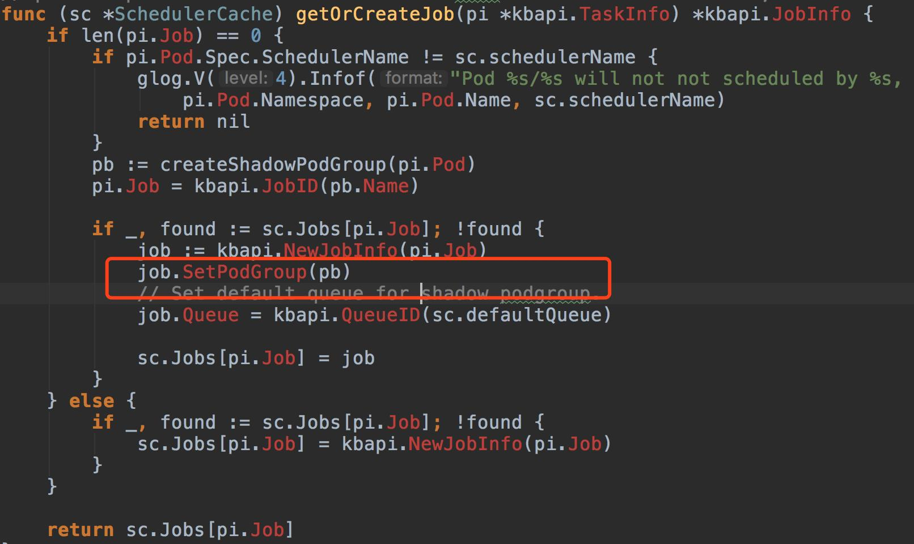

## kube-batch

gang scheduler介绍：一个kube-batch作业（kube-batch job）可能有多个pods, 这些pods要不全部执行，要不一个都不执行。

### 1. 名词

 + k8s job：一些pod集合
 + kube-batch task: pod，一个kube-batch task就是一个pod
 + kube-batch podGroup: 一组pod，这是kube-batch自定义的crd，主要用来实现gang scheduler。通过设置podgroup的minNumber，达到每次调度要么执行minNumber个pods.要么一个都不执行。
 + kube-batch job: 一组pod，指向某podGroup的所有pod(一个kube-batch job就是一个podGroup，见下图)，可以对应一个或多个k8s job

kube-batch\pkg\scheduler\cache\event_handlers.go

注意：

1. 一个k8s job必须指定一个podGroup，否则会指定一个shadow podGroup

2. 一个kube-batch job 可以对应一个或多个k8s job

   举例：

   如果有一个k8s的job, 假设为Job1，有2个pod, 他指定的podgroup是gp1. 同时还有一个k8s的job, 假设为Job2，有2个pod, 他指定的podgroup也可以是gp1.

   同时提交这俩个k8s job。

   在kube-batch看来，当前要调度的只有一个kube-batch 作业。这个kube-batch job总共有4个Tasks(pod)需要绑定。

### 2. 流程图

